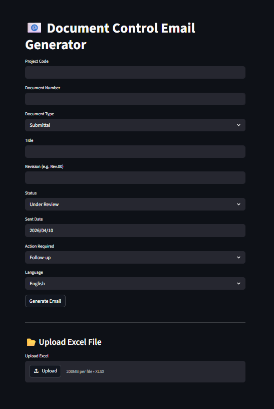

# 📧 Engineering Document Control Email Automation Tool
## 📸 Preview


A professional web-based tool built باستخدام **Python + Streamlit** لتوليد إيميلات Document Control بشكل تلقائي ودقيق بناءً على البيانات الفنية.

---

## 🚀 Features

- 📄 Generate professional emails for:
  - Submittals
  - RFIs
  - Drawings
  - Reports

- ⚙️ Smart Logic:
  - Auto-detect recipient (Consultant / Contractor / Client)
  - Status-based email generation
  - Follow-up / Resubmit scenarios

- 🌍 Bilingual Support:
  - English (Professional Business)
  - Arabic (Formal Engineering Style)

- 📊 Excel Automation:
  - Upload Excel file
  - Generate bulk emails (multiple documents)
  - Filter by status

- 📥 Export:
  - Download generated emails as CSV

---

## 🧠 Use Case

This tool is designed for:
- Document Controllers
- Site Engineers
- Technical Office Engineers
- Project Coordinators

To automate repetitive email tasks and ensure consistency in engineering communication.

---

## 🛠️ Tech Stack

- Python
- Streamlit
- Pandas
- OpenPyXL

---

## 🌐 Live Demo

👉 https://dc-email-generator.streamlit.app

---

## 📂 How to Run Locally

```bash
pip install -r requirements.txt
streamlit run app.py
